# 🏠 Design Your Floor

<div align="center">


**An Interactive Online Tile & Hardware Showroom with Delivery & Installation Services**

**Final Year Project | BEng (Hons) Software Engineering**

Developed using **Python Flask**, **MySQL**, **Bootstrap**, **HTML**, **CSS**, and **JavaScript**

</div>

---

# 📖 About the Project

**Design Your Floor (DYF)** is a modern full-stack web application developed to digitally transform Sri Lanka's tile and hardware industry.

The platform provides customers with a complete digital solution for purchasing tiles and hardware, calculating tile quantities, booking verified tile installers, scheduling deliveries, and tracking orders through a single integrated system.

Unlike the traditional manual workflow that requires visiting multiple physical showrooms, DYF centralizes the entire purchasing and installation process into one user-friendly web application.

---

# ✨ Features

## 👤 Customer

- User Registration
- Secure Login
- Browse Tile Catalogue
- Browse Hardware Products
- Product Search & Filtering
- Tile Quantity Calculator
- Product Comparison
- Shopping Cart
- Checkout System
- Online Order Placement
- Delivery Scheduling
- Order Tracking
- Book Verified Tile Installers
- View Installer Profiles
- Ratings & Reviews
- Order History

---

## 🏢 Supplier

- Supplier Dashboard
- Product Management
- Inventory Management
- Add/Edit/Delete Products
- Order Management
- Delivery Assignment
- Sales Analytics

---

## 👷 Tile Installer

- Installer Dashboard
- View Available Jobs
- Accept Installation Requests
- Update Installation Progress
- Manage Availability
- Customer Ratings

---

## 🚚 Delivery Partner

- Delivery Dashboard
- Assigned Deliveries
- Delivery Status Updates
- Track Deliveries

---

## 🔐 Administrator

- Admin Dashboard
- User Management
- Product Management
- Supplier Management
- Installer Verification
- Order Monitoring
- Reports & Analytics
- System Management

---

# 🖼 Screenshots

# 🖼 Screenshots

The following screenshots demonstrate the main functionalities and user interfaces of the **Design Your Floor** web application.

---

## 🏠 Home Page

Landing page with an overview of tile and hardware products, services, and system features.

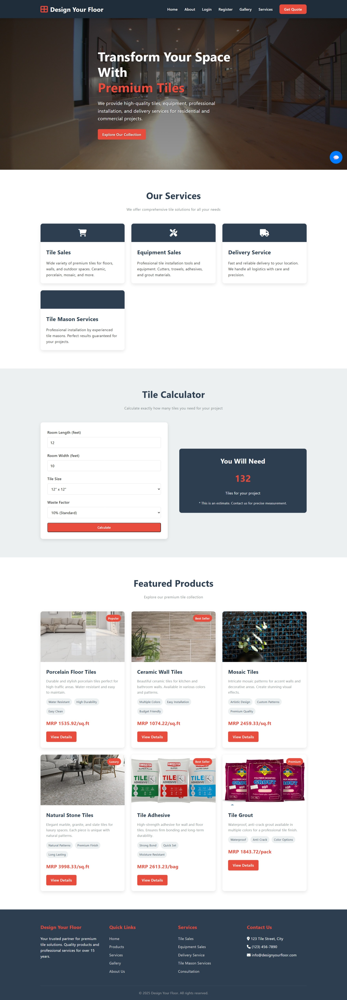

---

## 🔐 User Authentication

Customer registration and secure login functionality.

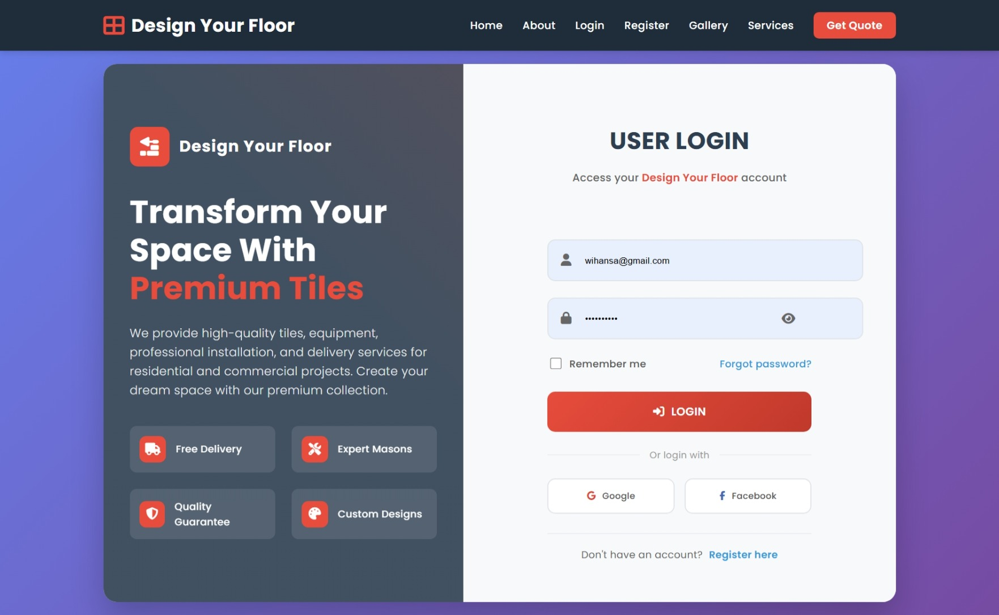

---

## 🏪 Tile & Hardware Product Catalogue

Users can browse available tiles and hardware products with product details.

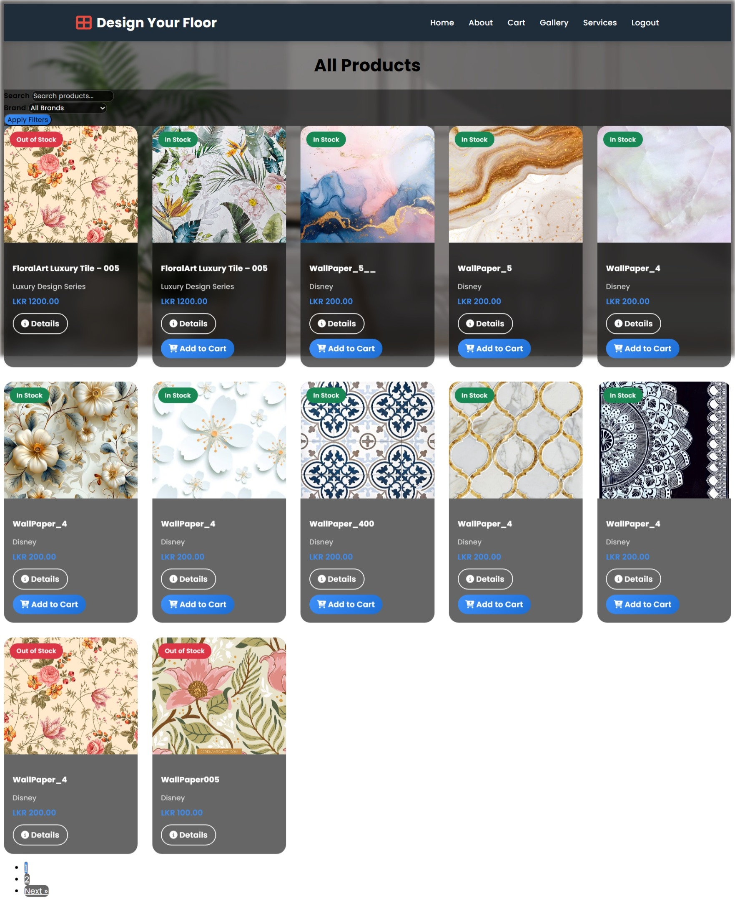

---

## 🔍 Product Search & Filtering

Search and filter products based on categories and requirements.

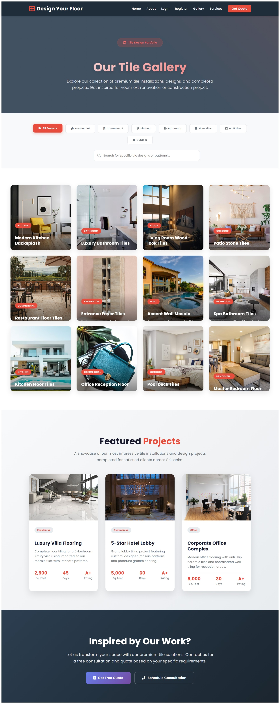

---

## 📐 Tile Quantity Calculator

Calculates the required number of tiles based on room dimensions.

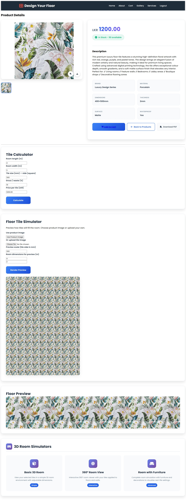

---

## 🛒 Shopping Cart & Checkout

Customers can add products, review orders, and proceed with purchases.

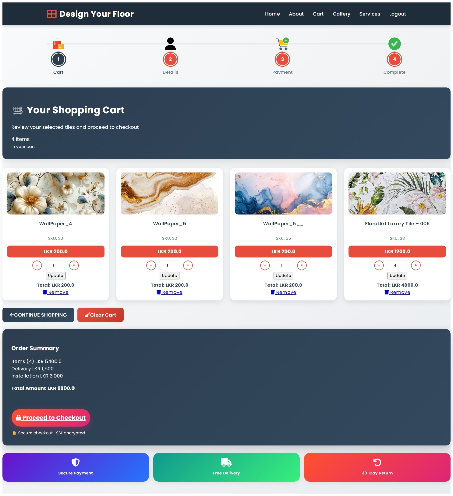

---

## 📦 Order & Delivery Management

Customers can track orders and delivery status.

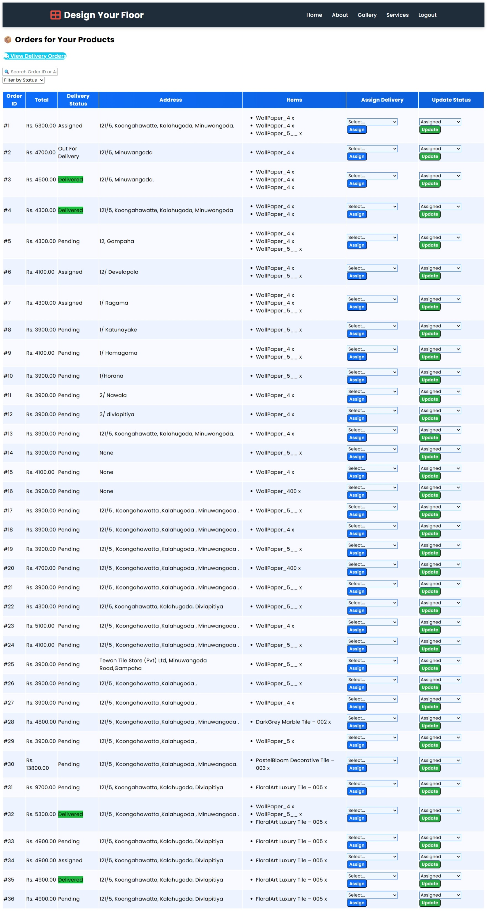

---

## 👷 Installer Booking System

Customers can view verified installers and request installation services.

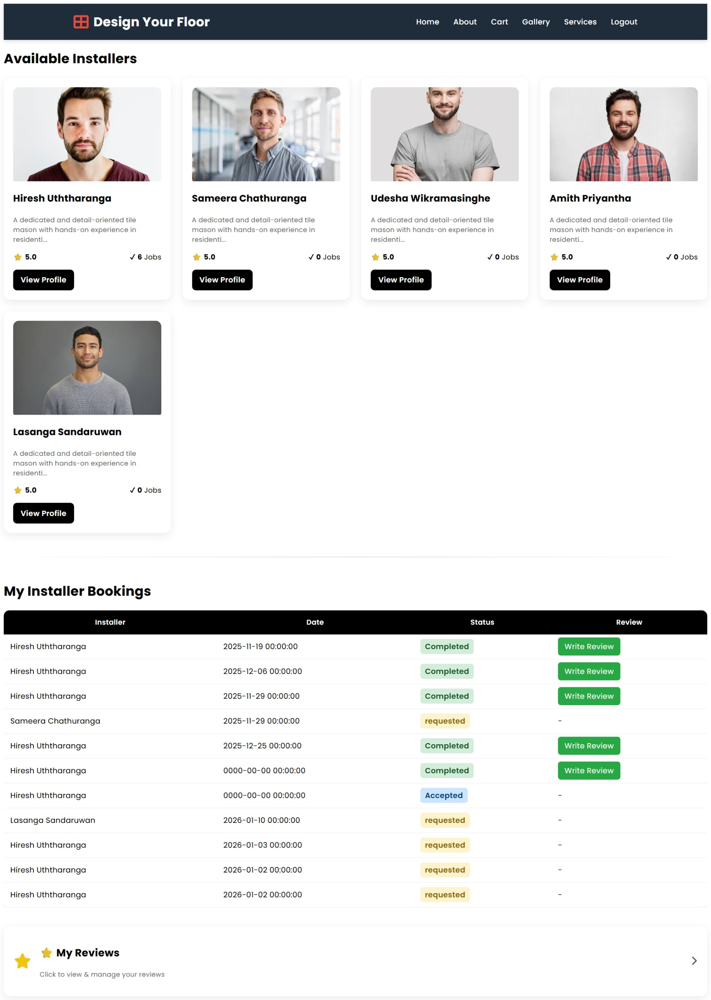

---

## 👤 Customer Dashboard

Customer dashboard for managing orders, bookings, and reviews.

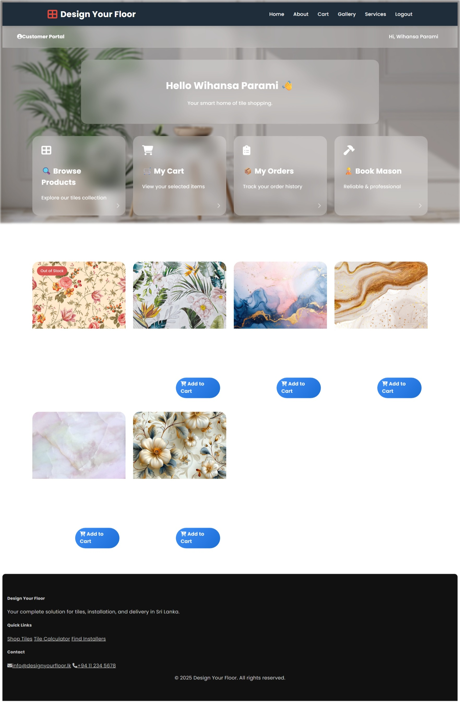

---

## 🏢 Supplier Dashboard

Supplier interface for managing products, inventory, and orders.

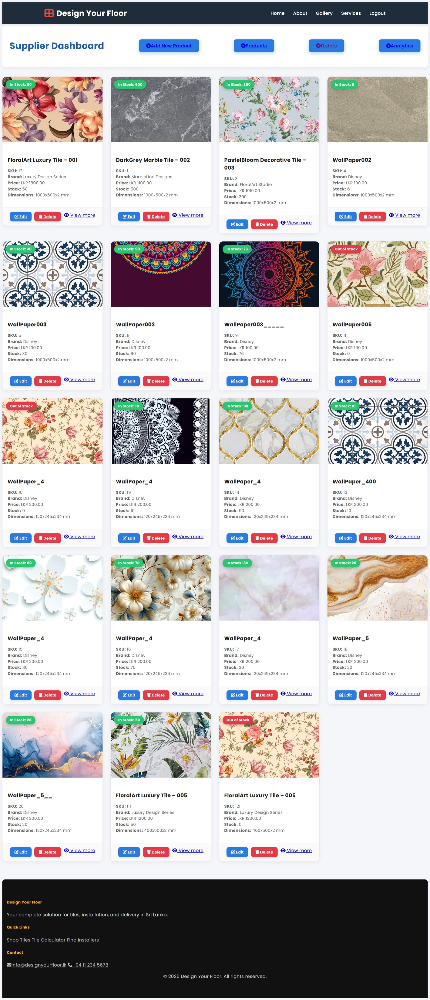

---

## 🚚 Delivery Partner Dashboard

Delivery management interface for assigned deliveries and status updates.

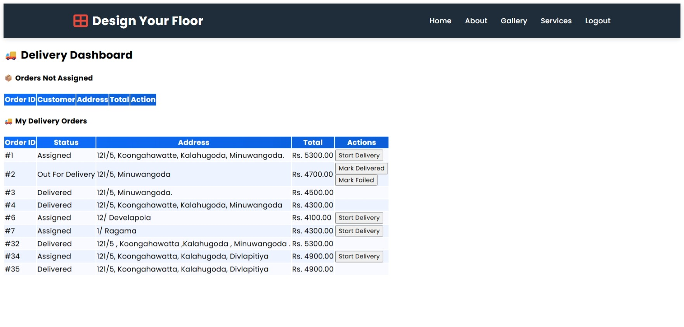

---

## 🔐 Administrator Dashboard

Admin panel for managing users, products, suppliers, installers, and reports.

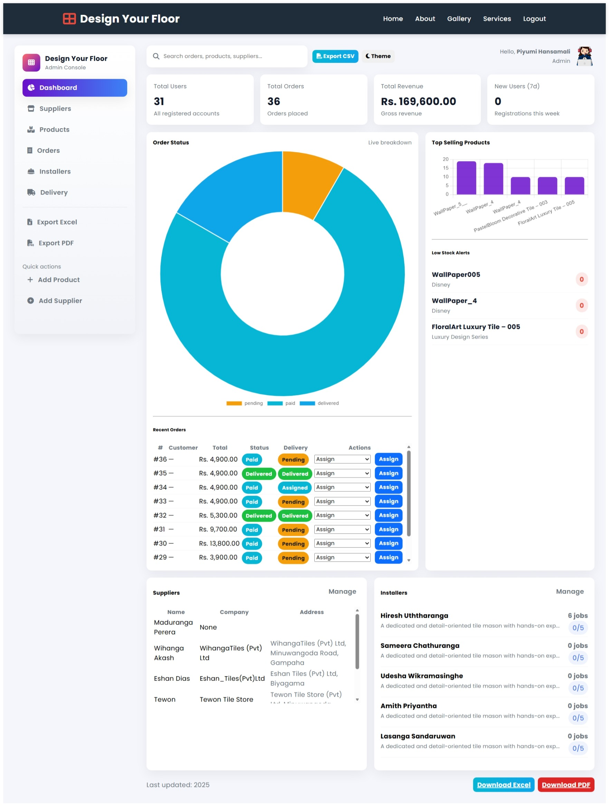

---

## 🏠 3D Room Preview

Interactive room visualization feature for previewing floor designs.

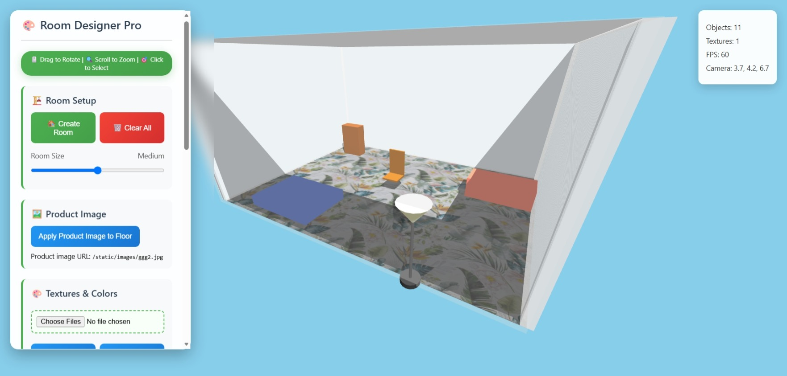

---

## 🤖 AI Features

AI-based features integrated into the platform for improving customer experience.

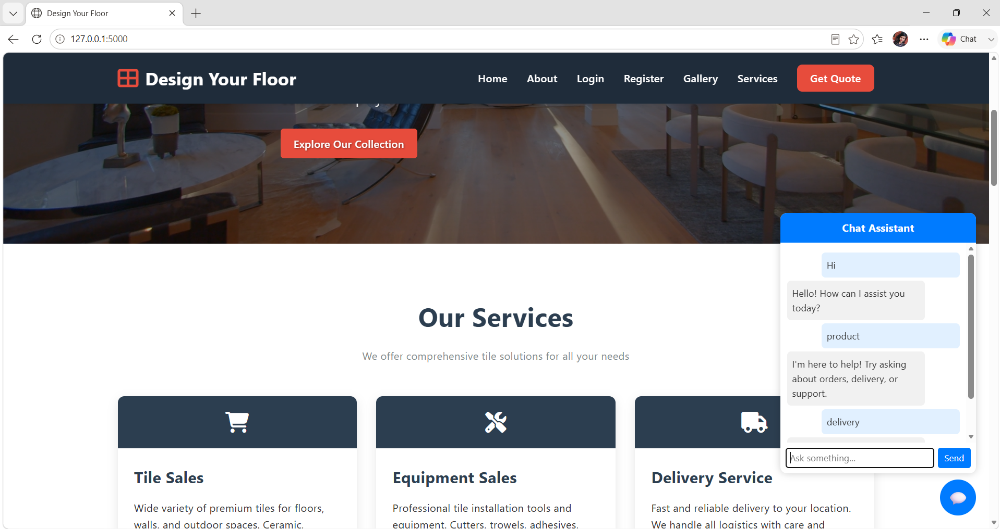

---

# 🎥 Demo Video

Watch the complete project demonstration here.

🔗 **Demo Video**

https://your-demo-video-link

---

# 🚀 System Modules

```
Authentication Module

Customer Module

Supplier Module

Installer Module

Delivery Module

Admin Module

Tile Catalogue Module

Hardware Store Module

Shopping Cart Module

Order Management Module

Delivery Management Module

Tile Calculator Module

Review & Rating Module

Analytics Module

3D Room Preview Module
```

---

# 🏗 System Architecture

```
                    Users

                       │

            HTML • CSS • Bootstrap

                       │

                JavaScript (Frontend)

                       │

                 Flask Application

                       │

       Routes → Controllers → Models

                       │

               Business Logic Layer

                       │

               MySQL Database Server

```

---

# 🛠 Technology Stack

## Frontend

- HTML5
- CSS3
- Bootstrap 5
- JavaScript

## Backend

- Python
- Flask

## Database

- MySQL
- phpMyAdmin

## Development Tools

- Visual Studio Code
- XAMPP
- Git
- GitHub

---

# 📂 Project Structure

```
DesignYourFloor/

│

├── app/

│   ├── routes/

│   ├── models/

│   ├── templates/

│   ├── static/

│   ├── forms/

│   ├── utils/

│   └── __init__.py

│

├── migrations/

├── instance/

├── uploads/

├── database/

├── requirements.txt

├── config.py

├── run.py

└── README.md
```

---

# ⚙ Installation Guide

## 1 Clone Repository

```bash
git clone https://github.com/YourUsername/design-your-floor.git
```

---

## 2 Move into Project

```bash
cd design-your-floor
```

---

## 3 Create Virtual Environment

Windows

```bash
python -m venv venv
```

Activate

```bash
venv\Scripts\activate
```

Mac/Linux

```bash
python3 -m venv venv

source venv/bin/activate
```

---

## 4 Install Dependencies

```bash
pip install -r requirements.txt
```

---

## 5 Configure Database

- Open phpMyAdmin

- Create Database

```
designyourfloor
```

Import

```
database/designyourfloor.sql
```

---

## 6 Configure Environment

Update your configuration file.

Example

```python
MYSQL_HOST='localhost'

MYSQL_USER='root'

MYSQL_PASSWORD=''

MYSQL_DB='designyourfloor'
```

---

## 7 Run Application

```bash
python run.py
```

---

Visit

```
http://127.0.0.1:5000
```

---

# 📋 Requirements

- Python 3.10+
- Flask
- MySQL Server
- XAMPP
- Git
- Visual Studio Code

---

# 💻 Main Functionalities

✅ User Authentication

✅ Role Based Access Control

✅ Tile Catalogue

✅ Hardware Store

✅ Shopping Cart

✅ Tile Calculator

✅ Product Comparison

✅ Delivery Scheduling

✅ Installer Booking

✅ Ratings & Reviews

✅ Admin Dashboard

✅ Supplier Dashboard

✅ Analytics

---

# 🗄 Database

Main Tables

- Users
- Customers
- Suppliers
- Installers
- Products
- Categories
- Orders
- Order Items
- Deliveries
- Payments
- Reviews
- Analytics

---

# 🔐 Security

- Password Hashing
- Session Authentication
- Input Validation
- Role-Based Access Control
- Secure Database Queries
- Error Handling

---

# 📈 Future Improvements

- AI Product Recommendation
- AI Interior Design Assistant
- AR Room Visualization
- Mobile Application
- Stripe Payment Gateway
- Google Maps Integration
- Live GPS Delivery Tracking
- SMS Notifications
- Email Notifications
- Chat System
- AI Chatbot
- Sales Prediction
- Admin Analytics Dashboard

---

# 📊 Development Methodology

- Agile Scrum
- Kanban Board
- Incremental Development
- Continuous Testing
- User Acceptance Testing (UAT)

---

# 🧪 Testing

- Unit Testing
- Functional Testing
- Integration Testing
- White Box Testing
- User Acceptance Testing

---

# 🤝 Contributing

Contributions are welcome.

1. Fork the repository

2. Create a new branch

```bash
git checkout -b feature-name
```

3. Commit your changes

```bash
git commit -m "Added new feature"
```

4. Push changes

```bash
git push origin feature-name
```

5. Open a Pull Request

---

# 📚 Academic Information

**Project Title**

Design Your Floor: An Interactive Online Tile & Hardware Showroom with Delivery & Installation Services

**Degree**

Bachelor of Engineering (Honours) in Software Engineering

**University**

London Metropolitan University

---

# 👩‍💻 Author

**H. Kaveesha Nethmini**

Software Engineering Graduate

📧 Email: your-email@example.com

🔗 LinkedIn: https://linkedin.com/in/your-profile

🌐 Portfolio: https://your-portfolio.com

---

# 🙏 Acknowledgements

Special thanks to:

- London Metropolitan University
- Project Supervisors
- Lecturers
- Friends and Family
- Open Source Community

---

# 📄 License

This project was developed for academic purposes as part of the BEng (Hons) Software Engineering degree.

Feel free to use this project for educational and research purposes with proper attribution.

---

<div align="center">

⭐ If you like this project, don't forget to **Star** the repository!

Made with ❤️ using **Python**, **Flask**, and **MySQL**

</div>
